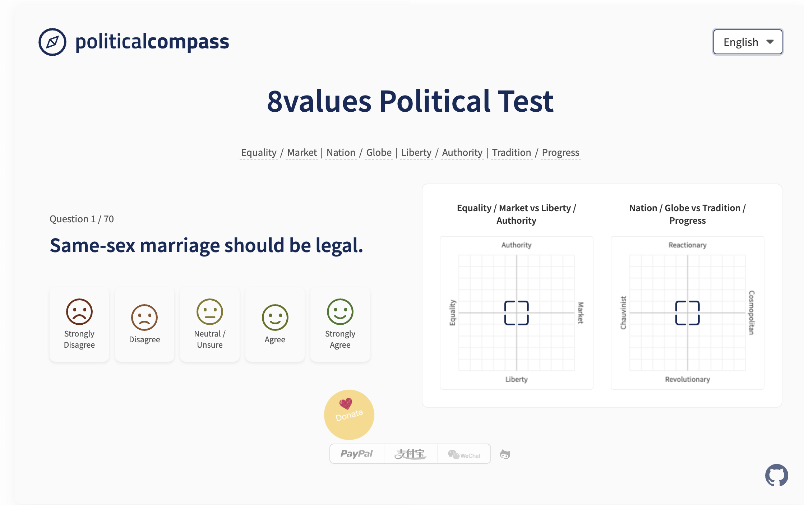
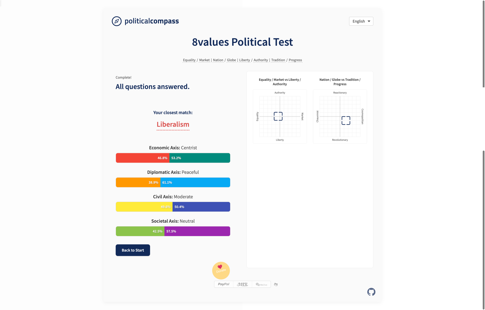

# 8values Political Compass Test / 8values 政治坐标测试

**(English)**

This project is an implementation of the 8values political compass test. It assesses your political alignment across four different axes based on your answers to a series of questions. The results are displayed visually on two charts and through percentage bars, along with the closest matching political ideology from a predefined list.

**(中文)**

本项目是一个 8values 政治坐标测试的实现。它通过一系列问题来评估您在四个不同坐标轴上的政治倾向。测试结果将通过两个图表和百分比条进行可视化展示，并匹配一个预定义列表里最接近的政治意识形态。

---

## ✨ Features / 特点

**(English)**

* **8 Values / 4 Axes:** Measures political views across Economic (Equality vs. Market), Diplomatic (Nation vs. Globe), Civil (Liberty vs. Authority), and Societal (Tradition vs. Progress) axes.
* **Dual Chart Visualization:** Results are plotted on two separate 2D compass charts:
    * Economic vs. Civil
    * Diplomatic vs. Societal
* **Detailed Results Page:** Shows percentage scores for each pole of the four axes using progress bars and provides descriptive labels for your overall position on each axis.
* **Ideology Matching:** Calculates the closest political ideology based on your scores using Euclidean distance in 4D space. Provides names and descriptions for many ideologies.
* **Multi-language Support:** Currently supports **English (en), Chinese (zh), Spanish (es), and Portuguese (pt)**, dynamically loaded based on user selection or browser preference. *(Updated)*
* **Question Shuffling:** Presents questions in a random order for each test taker.
* **Previous Question Button:** Allows users to go back and change their answer to the previous question.
* **Responsive Design:** Adapts to different screen sizes, from mobile to desktop.
* **Tooltips:** Provides helpful explanations for axis labels and ideology results on hover.

**(中文)**

* **8 Values / 4 坐标轴:** 测量经济（平等 vs. 市场）、外交（国家 vs. 全球）、政治（自由 vs. 威权）、社会（传统 vs. 进步）四个坐标轴上的政治观点。
* **双图表可视化:** 测试结果被绘制在两个独立的二维坐标图上：
    * 经济 vs. 政治
    * 外交 vs. 社会
* **详细结果页面:** 使用进度条显示四个坐标轴上每个极端的百分比得分，并为每个轴上的总体立场提供描述性标签。
* **意识形态匹配:** 使用四维空间中的欧几里得距离计算与您的分数最接近的政治意识形态。提供多种意识形态的名称和描述。
* **多语言支持:** 目前支持**英语（en）、中文（zh）、西班牙语（es）和葡萄牙语（pt）**，根据用户选择或浏览器偏好动态加载。 *(已更新)*
* **问题随机排序:** 为每位测试者随机排列问题顺序。
* **“返回”按钮:** 允许用户返回并修改上一题的答案。
* **响应式设计:** 适应从移动设备到桌面设备的不同屏幕尺寸。
* **提示信息:** 鼠标悬停在坐标轴标签和意识形态结果上时，提供有用的解释说明。

---

## 📸 Screenshots / 截图

*Example Question Page / 问题页面示例:*

*Example Results Page / 结果页面示例:*

---

## 🧭 The 8 Values / 8 个价值维度

**(English)**

1.  **Economic Axis:**
    * **Equality:** Belief that the economy should distribute value evenly. Supports progressive taxes, social programs, potentially socialism.
    * **Market:** Belief that the economy should focus on growth. Supports lower taxes, privatization, deregulation, potentially laissez-faire capitalism.
2.  **Diplomatic Axis:**
    * **Nation:** Patriotic and nationalist beliefs. Values military, strength, sovereignty, potentially territorial expansion.
    * **Globe:** Cosmopolitan and globalist beliefs. Emphasizes diplomacy, cooperation, integration, potentially a world government.
3.  **Civil Axis:**
    * **Liberty:** Belief in strong civil liberties and democracy. Opposes state intervention in personal life.
    * **Authority:** Belief in strong state power. Supports state intervention, surveillance, potentially censorship or autocracy.
4.  **Societal Axis:**
    * **Tradition:** Belief in traditional values and moral codes. Often religious, supports the status quo or status quo ante.
    * **Progress:** Belief in social change and rationality. Often secular/atheist, supports environmental action and scientific research.

**(中文)**

1.  **经济轴 (Economic Axis):**
    * **平等 (Equality):** 认为经济应在民众中平均分配价值。支持累进税、社会计划，极端情况下支持社会主义。
    * **市场 (Market):** 认为经济应侧重于快速增长。支持减税、私有化、放松管制，极端情况下支持自由放任资本主义。
2.  **外交轴 (Diplomatic Axis):**
    * **国家 (Nation):** 爱国主义和民族主义者。重视军事、实力、主权，极端情况下支持领土扩张。
    * **全球 (Globe):** 世界主义和全球主义者。强调外交、合作、一体化，极端情况下支持世界政府。
3.  **政治轴 (Civil Axis):**
    * **自由 (Liberty):** 信仰强大的公民自由和民主。反对国家干预个人生活。
    * **威权 (Authority):** 信仰强大的国家权力。支持国家干预个人生活、政府监视，极端情况下支持审查制度或独裁统治。
4.  **社会轴 (Societal Axis):**
    * **传统 (Tradition):** 相信传统价值观并严格遵守道德准则。通常（但不总是）有宗教信仰，支持维持现状或过去的现状。
    * **进步 (Progress):** 相信社会变革和理性。通常（但不总是）是世俗主义者或无神论者，支持环保行动和科技研究。

---

## 🚀 How to Run / 如何运行

**(English)**

1.  Clone or download this repository.
2.  Navigate to the `src/` directory.
3.  Open the `index.html` file in your web browser.

**(中文)**

1.  克隆或下载此代码仓库。
2.  进入 `src/` 目录。
3.  在您的网页浏览器中打开 `index.html` 文件。

---

## 👤 Author / 作者

* **miaohancheng** - [GitHub Profile](https://github.com/miaohancheng)

---
